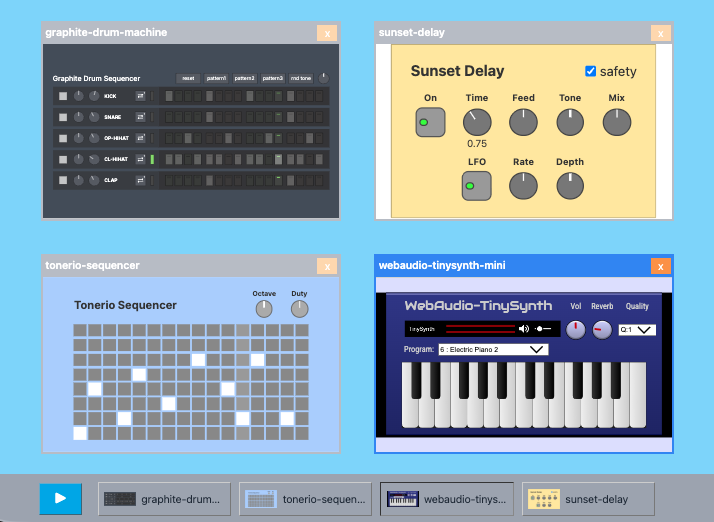

# mdi-app

A small host application example with MDI window interface.

## screenshot



## about

This example demonstrates multiple window like interface.

Windows can be moved, resized, and shown or hidden.

Even though windows appear to open and close, every unit stays mounted in the DOM and is only hidden visually with styling. Each unit is an iframe or a Web Component, and its audio and sequencing logic cannot run unless it is actually loaded in the DOM, hence this approach.

The units are connected as follows.

```
drum machine --> audio output
sequencer --> synth --> delay --> audio output
```

Tap the `Play/Pause` button in the bottom left corner to start playback.

## prepare

```
pnpm install
```

## run

```
pnpm run dev
```

For the first run, unit-loader vite plugin downloads units and cache them `../.wafer-cache` folder.
