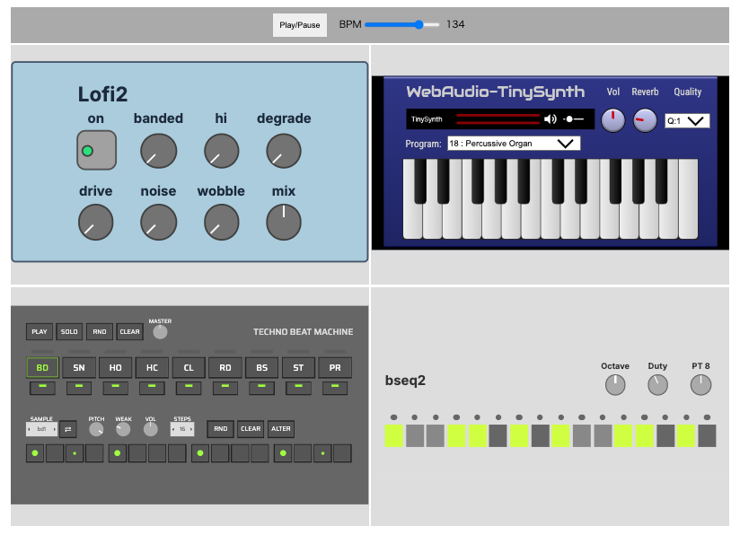

# simple-session vanilla

A minimum host app example with plain javascript, without bundlers.

## screenshot



## about

This sample loads a fixed set of units, wires them together, and plays them in sync with a global clock.

The units are connected as follows.

```
drum machine --> audio output
sequencer --> synth --> delay --> audio output
```

Use the `Play/Pause` button in the top bar to start playback, and the BPM slider to change the tempo.

## prepare

Run `fetch-units.sh` first. The script clones required unit repos and copies the needed unit folders into `./units`.

```
sh ./fetch-units.sh
```

## run

```
npx lite-server
```

or any other local server if you have.
