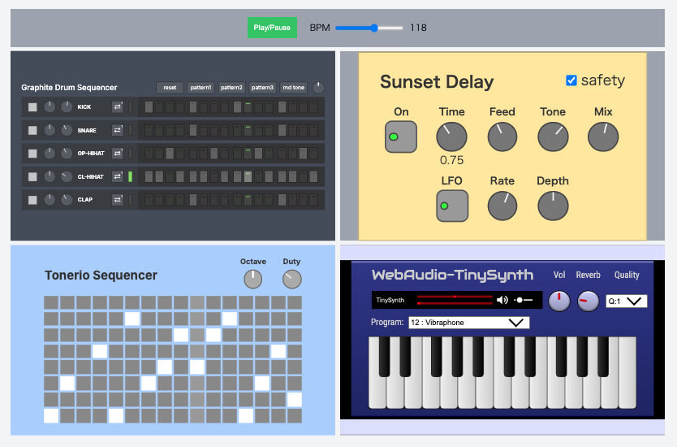

# simple-session

A minimum host app example with react, vite, typescript.

## screenshot



## about

This sample loads a fixed set of units, wires them together, and plays them in sync with a global clock.

The units are connected as follows.

```
drum machine --> audio output
sequencer --> synth --> delay --> audio output
```

Use the `Play/Pause` button in the top bar to start playback, and the BPM slider to change the tempo.

## prepare

```
pnpm install
```

## run

```
pnpm run dev
```

For the first run, unit-loader vite plugin downloads units and cache them `../.wafer-cache` folder.
