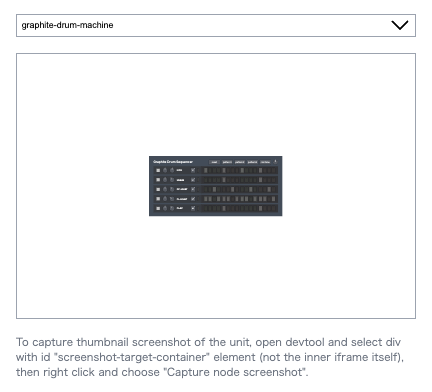

# Thumbnail capturing utility

This app is used to capture thumbnail image for the unit.

## about

If you created a new unit, add the path to `unitSourceUrls` array in `src/unit-source-urls.ts` and run the app.
Capture the image and add it to your unit folder with the name `unit-thumbnail.png`.

## screenshot



## prepare

```
pnpm install
```

## run

```
pnpm run dev
```

For the first run, unit-loader vite plugin downloads units and cache them `../.wafer-cache` folder.
